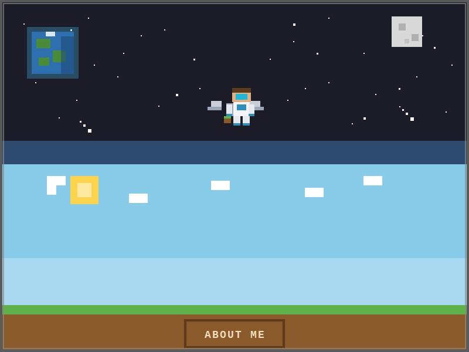

<!-- TYPING ANIMATION -->

 

<!-- ZONA 1 + 2: ANGKASA → ATMOSFER (1 gambar panjang) -->

  

<!-- ==================== ABOUT ME (LIVE GITHUB) ==================== -->

 

<!-- Live GitHub metrics -->

  

<!-- Live stats cards (auto-update) -->

  

<!-- Tentang Saya -->
<table align="center">
  <tr>
    <td align="left" width="50%" valign="top">
      <h3 style="color:#00D2FF;font-family:'Courier New',monospace;">▌ Tentang Saya</h3>
      

        Merancang sistem embedded, firmware, dan perangkat lunak.
        Dari sensor hingga cloud, dari PCB hingga dashboard.
        Lebih dari 8 tahun membangun di setiap lapisan teknologi.
      

      <h3 style="color:#87CEEB;font-family:'Courier New',monospace;">▌ Spesialisasi</h3>
      

        • Drone Systems — flight controller, GCS, navigasi otonom 
        • Digital ECU — engine control, CAN bus, sensor fusion 
        • Elektronika — PCB design, power electronics, signal proc. 
        • Software — desktop, mobile, API, microservices
      

    </td>
    <td align="left" width="50%" valign="top">
      <h3 style="color:#00D2FF;font-family:'Courier New',monospace;">▌ Bahasa Favorit</h3>
      

        
        
        
      

      <h3 style="color:#87CEEB;font-family:'Courier New',monospace;">▌ Stack</h3>
      

        
        
        
        
        
      

    </td>
  </tr>
</table>

<!-- BERSAMBUNG KE ZONA 3: PERMUKAAN ============================== -->
