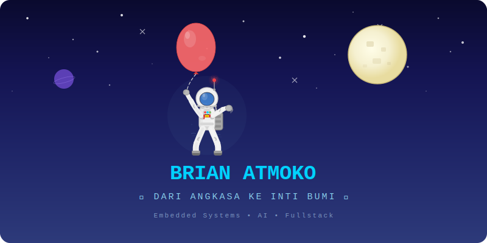

<!-- ZONA 1: LUAR ANGKASA ================================================ -->

 

<!-- Space Banner SVG -->

 

<!-- Typing Animation -->

  

<!-- Atmosphere transition SVG -->

<!-- ZONA 2: ATMOSFER ==================================================== -->

 

<!-- About Me Card -->
<pre style="color:#E0E8F0;font-size:13px;line-height:1.8;font-family:'Courier New',monospace;border:1px solid #6A9EC8;padding:20px 30px;border-radius:8px;display:inline-block;text-align:left;background:rgba(26,36,80,0.4);">
  Brian Atmoko
  Embedded Systems &amp; Fullstack Engineer
  Indonesia

  Lebih dari 8 tahun merancang sistem embedded,
  firmware, dan perangkat lunak. Dari sensor
  hingga cloud, dari PCB hingga dashboard.

  Spesialisasi:
    • Sistem Drone — flight controller, GCS, navigasi otonom
    • Digital ECU — engine control, CAN bus, sensor fusion
    • Elektronika — PCB design, power electronics, signal processing
    • Software — desktop, mobile, API, microservices

  Favorit: C++ | Java | Python

  "Dari hardware ke cloud, bangun di setiap lapisan."
</pre>

  

<!-- Surface transition SVG -->

<!-- BERSAMBUNG KE ZONA 3: PERMUKAAN ==================================== -->
