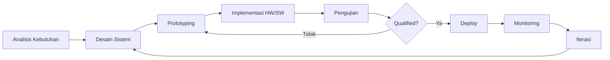

<div align="center">
  <a href="https://git.io/typing-svg">
    
  </a>

  <br><br>

  

  <br><br>

  <a href="https://github.com/brianatmoko?tab=followers">
    
  </a>
  
</div>

<br>

---

## 🧑‍💻 Profil

```cpp
class BrianAtmoko {
public:
    struct Skill {
        string bidang;
        vector<string> stack;
        int tahun_pengalaman;
    };

    string nama       = "Brian Atmoko";
    string peran      = "Embedded Systems & Fullstack Engineer";
    string lokasi     = "Indonesia";
    string motto      = "Dari hardware ke cloud, bangun di setiap lapisan.";

    Skill daftar_keahlian[5] = {
        {"Sistem Drone",         {"C++", "STM32", "FreeRTOS", "GPS/INS", "Telemetry"}, 6},
        {"Digital ECU",          {"C", "ARM Cortex", "CAN Bus", "Sensor Fusion"},       5},
        {"Embedded Electronics", {"PCB Design", "Altium", "KiCad", "SPICE"},             8},
        {"Rekayasa Perangkat",   {"Java", "Python", "React", "Flutter", "Qt"},          7},
        {"AI & Data",            {"TensorFlow", "PyTorch", "OpenCV", "Pandas"},          3},
    };

    string bahasa_favorit[3] = {"C++", "Java", "Python"};

    void berkarya() {
        while(ada_masalah) selesaikan();
    }
};
```

<br>

---

## 🚀 Proyek Unggulan

<div align="center">

### 🧠 MOKO-AI

**Proyek super besar — Sistem Kecerdasan Buatan Terintegrasi**

[]()
[]()
[]()
[]()
[]()

```
MOKO-AI adalah ekosistem AI yang mencakup:
├── Inference Engine        — Optimasi model untuk edge deployment
├── Vision Pipeline         — Computer vision real-time (drone, CCTV)
├── Predictive Analytics    — Prediksi berbasis sensor data
├── Natural Language        — Asisten cerdas berbahasa Indonesia
└── AutoML Framework        — Training & deployment otomatis
```

*Status: Dalam pengembangan aktif*

<br>

---

### ✈️ Sistem Drone

[]()
[]()
[]()
[]()
[]()

```
Firmware flight controller │ Ground Control Station │ Navigasi otonom
Sensor fusion (IMU+GPS+Baro) │ Telemetry 900MHz/2.4GHz │ Waypoint mission
```

<br>

---

### 🛞 Digital ECU

[]()
[]()
[]()
[]()

```
Engine control firmware │ CAN bus communication stack
Real-time sensor fusion │ Fuel injection mapping │ OBD-II diagnostics
```

<br>

---

### ⚡ Rekayasa Elektronika

[]()
[]()
[]()
[]()

```
Desain PCB multilayer │ Simulasi rangkaian │ Power electronics
Signal integrity │ Sensor interface │ EMC/EMI compliance
```

<br>

---

### 💻 Rekayasa Perangkat Lunak

[]()
[]()
[]()
[]()
[]()

```
Aplikasi desktop │ REST API │ Mobile cross-platform │ CI/CD pipeline
Microservices │ Database design │ Cloud deployment │ Monitoring
```

</div>

<br>

---

## 🛠️ Tumpukan Teknologi

<div align="center">

### Bahasa Pemrograman

<p>
  
</p>

### Embedded & Hardware

<p>
  
</p>

### Web, Mobile & Desktop

<p>
  
</p>

### Database, DevOps & AI

<p>
  
</p>

</div>

<br>

---

## 🔄 Alur Kerja



| Fase | Tools | Output |
|------|-------|--------|
| **Analisis** | Notion, Draw.io | Spesifikasi teknis |
| **Desain** | Altium, KiCad, Figma | Skematik, layout PCB, wireframe |
| **Embedded** | STM32CubeIDE, VS Code, PlatformIO | Firmware, bootloader |
| **Software** | IntelliJ, VS Code, Qt Creator | Aplikasi, API, GUI |
| **Testing** | Oscilloscope, Logic Analyzer, pytest | Laporan pengujian |
| **Deploy** | Docker, GitHub Actions, Ansible | Image, CI/CD pipeline |

<br>

---

## 📊 Statistik GitHub

<div align="center">

  
  

  <br><br>

  
  

</div>

<br>

---

## 🐍 Kontribusi

<div align="center">
  <picture>
    <source media="(prefers-color-scheme: dark)" srcset="https://github.com/platane/snk/raw/output/github-contribution-grid-snake-dark.svg" />
    <source media="(prefers-color-scheme: light)" srcset="https://github.com/platane/snk/raw/output/github-contribution-grid-snake.svg" />
    
  </picture>
</div>

<br>

---

## 📫 Kontak

<div align="center">
  <br>
  <a href="https://github.com/brianatmoko">
    
  </a>
  <a href="mailto:brianatmoko@email.com">
    
  </a>
  <a href="https://linkedin.com/in/brianatmoko">
    
  </a>
  <a href="https://brianatmoko.dev">
    
  </a>
  <br><br>

  <i>"Dari firmware hingga cloud, dari sensor hingga dashboard — saya bangun di setiap lapisan."</i>

  <br><br>

  
</div>
